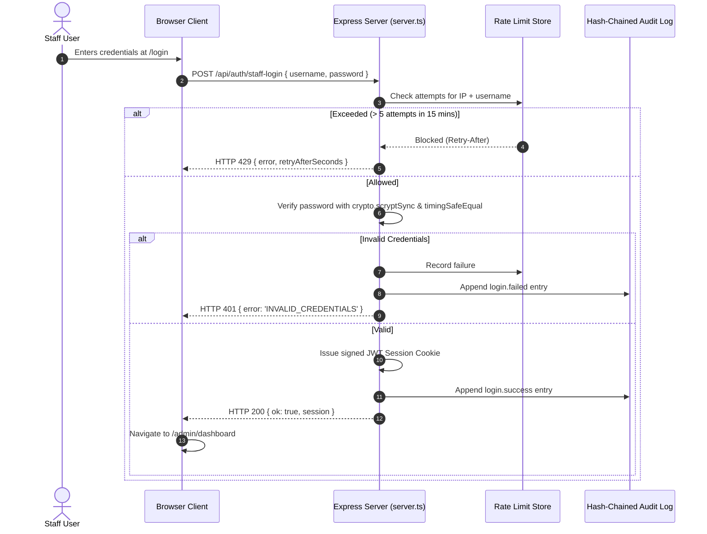
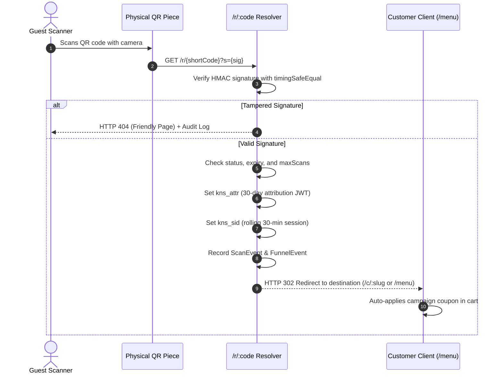

# Kaonashi Authentication Flows

```mermaid
sequenceDiagram
    autonumber
    actor Staff as Staff User
    participant Browser as Browser Client
    participant Server as Express Server (server.ts)
    participant RateLimiter as Rate Limit Store
    participant Audit as Hash-Chained Audit Log

    Staff->>Browser: Enters credentials at /login
    Browser->>Server: POST /api/auth/staff-login { username, password }
    Server->>RateLimiter: Check attempts for IP + username
    alt Exceeded (> 5 attempts in 15 mins)
        RateLimiter-->>Server: Blocked (Retry-After)
        Server-->>Browser: HTTP 429 { error, retryAfterSeconds }
    else Allowed
        Server->>Server: Verify password with crypto.scryptSync & timingSafeEqual
        alt Invalid Credentials
            Server->>RateLimiter: Record failure
            Server->>Audit: Append login.failed entry
            Server-->>Browser: HTTP 401 { error: 'INVALID_CREDENTIALS' }
        else Valid
            Server->>Server: Issue signed JWT Session Cookie
            Server->>Audit: Append login.success entry
            Server-->>Browser: HTTP 200 { ok: true, session }
            Browser->>Browser: Navigate to /admin/dashboard
        end
    end
```

```mermaid
sequenceDiagram
    autonumber
    actor Guest as Guest Scanner
    participant QR as Physical QR Piece
    participant Resolver as /r/:code Resolver
    participant App as Customer Client (/menu)

    Guest->>QR: Scans QR code with camera
    QR->>Resolver: GET /r/{shortCode}?s={sig}
    Resolver->>Resolver: Verify HMAC signature with timingSafeEqual
    alt Tampered Signature
        Resolver-->>Guest: HTTP 404 (Friendly Page) + Audit Log
    else Valid Signature
        Resolver->>Resolver: Check status, expiry, and maxScans
        Resolver->>Resolver: Set kns_attr (30-day attribution JWT)
        Resolver->>Resolver: Set kns_sid (rolling 30-min session)
        Resolver->>Resolver: Record ScanEvent & FunnelEvent
        Resolver-->>App: HTTP 302 Redirect to destination (/c/:slug or /menu)
        App->>App: Auto-applies campaign coupon in cart
    end
```
